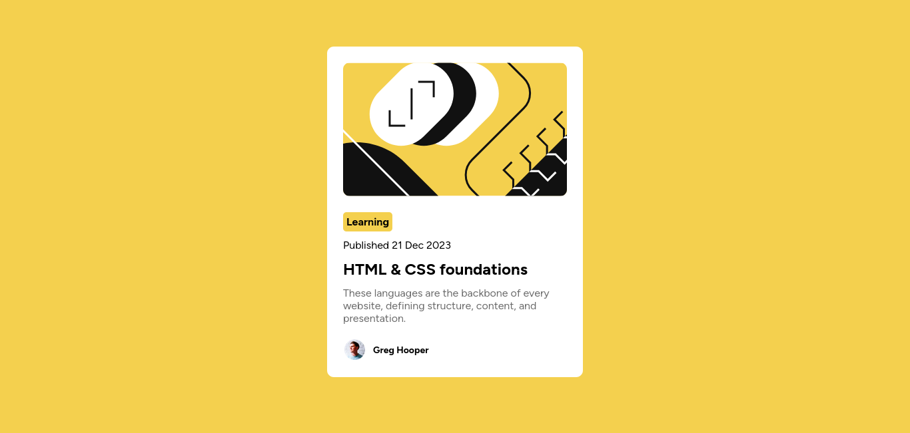

# Frontend Mentor - Blog preview card solution

This is a solution to the [Blog preview card challenge on Frontend Mentor](https://www.frontendmentor.io/challenges/blog-preview-card-ckPaj01IcS). Frontend Mentor challenges helps me improve my coding skills by building realistic projects!

## Table of contents

- [Overview](#overview)
  - [Screenshot](#screenshot)
  - [Links](#links)
- [My process](#my-process)
  - [Built with](#built-with)
  - [What I learned](#what-i-learned)
  - [Continued development](#continued-development)
- [Author](#author)
- [Final Words](#final-words)

## Overview

Users should be able to:

- See hover and focus states for all interactive elements on the page

### Screenshot



### Links

- Solution URL: [Add solution URL here](https://github.com/Preshgit/Blog-preview-card)
- Live Site URL: [Add live site URL here](https://preshgit.github.io/Blog-preview-card/)

## My process

### Built with

- Semantic HTML5 markup
- CSS custom properties
- Flexbox

### What I learned

During this project, I deepened my understanding of using **Flexbox** for layout structuring. Using the column and row Flexbox arrangement. Flexbox allowed me to easily center elements within the webpage by leveraging properties like justify-content and align-items. This made aligning content more efficient. With Flexbox, I could quickly align my elements horizontally and vertically, creating a more responsive and visually balanced design.

Additionally, I gained experience working with **Class selectors** in CSS. I learned how to target specific elements using their unique ID attributes to apply distinct styles for text formatting and spacing. This was useful in the case where I needed to apply styles to one particular element, while class selectors were effective for reusable styles across multiple elements.

I also learned to style hyper links.

```html
<body>
  <main>
    <div class="top">
      
      <h1>Learning</h1>
      <p>Published 21 Dec 2023</p>
      <h2>HTML & CSS foundations</h2>
      <p class="par">These languages are the backbone of every website, defining structure, content, and presentation.</p>
    </div>
    <div class="footer">
      
      <p class="par1" >Greg Hooper</p>
    </div>
  </main>  
</body>
```

```css
h2{
    font-size: 24px;
    font-weight: bolder;
    padding-top: 6px;
    padding-bottom: 6px;
    transition: color 200ms ease-in-out;
}
h2:hover{
    color: #F4D04E;
}
```

### Continued development

Code will be reviewed to make sure it absolutely responsive across multiple devices.

## Author

- Frontend Mentor - [@Preshgit](https://www.frontendmentor.io/profile/Preshgit)
- X - [@presh_ot](https://x.com/presh_OT)

## Final Words

Hi Reader 👋, I hope you enjoyed the read!
